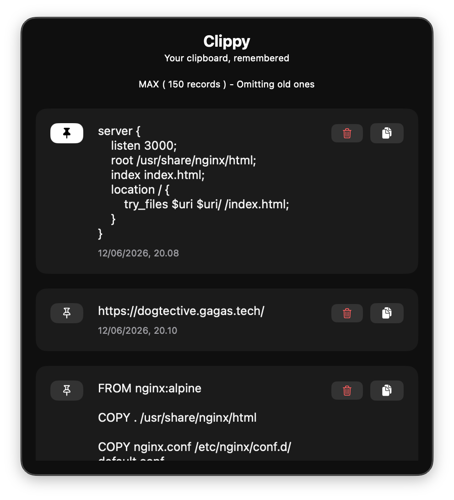

# Clippy · Clipboard Manager

A macOS menu bar app that remembers everything you copy.
Access your full clipboard history from the menu bar paste anything, anytime.

---

## How It Works

Clippy runs quietly in the menu bar and captures every text you copy.
Click the icon to browse your history, re-copy an item, or clear what you don't need.

---

## Features

- **Clipboard history** — never lose something you copied
- **Re-copy instantly** — click any item to copy it back to your clipboard
- **Delete entries** — remove individual items or clear everything
- **Persistent** — history survives app restarts
- **Lightweight** — lives in the menu bar, out of your way

---

## Screenshots

| Clippy |
|:------:|
|  |

---

## Tech Stack

- **SwiftUI** — UI and state management
- **SwiftData** — persistent clipboard history
- **NSPasteboard** — clipboard monitoring
- **MVVM** - Tech Architecture
